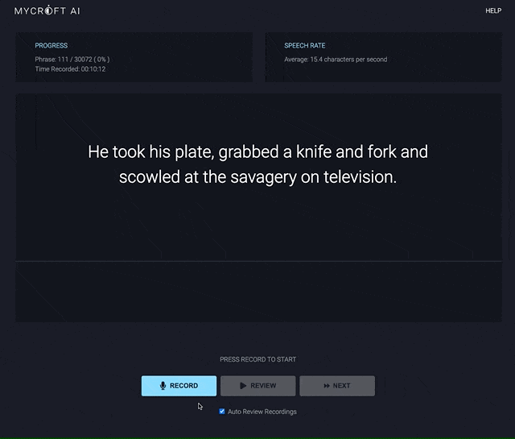

Mimic My Voice
===

> Create a Text to Speech Engine using Your Own Voice with Mycroft's Mimic Recording Studio & Coqui Text to Speech.

### NOTE:  This is a Work in Progress



## Features

- [X] [Mycroft Recording Studio](https://github.com/manifestinteractive/mimic-recording-studio) Custom Build and Setup Automation
- [X] [Coqui TTS](https://github.com/manifestinteractive/tts) Custom Build and Setup Automation
- [X] [AWS S3](https://aws.amazon.com/s3/) Backup & Restore

## Requirements

- [X] [Node v14+](https://nodejs.org/en/download/)
- [X] [Docker Desktop](https://www.docker.com/products/docker-desktop)
- [X] [AWS S3 Account](https://aws.amazon.com/s3) _( only required for Backup & Restore )_

## Developer Overview

#### Commands

Command                                | Description
---------------------------------------|--------------------------
[`mimic config`](docs/cmd-config.md)   | Configure Project
[`mimic setup`](docs/cmd-setup.md)     | Install Mimic & Mimic Studio
[`mimic studio`](docs/cmd-studio.md)   | Launch Mimic Recording Studio
[`mimic train`](docs/cmd-train.md)     | Launch Mimic Training
[`mimic backup`](docs/cmd-backup.md)   | Backup Mimic Sessions to AWS S3
[`mimic restore`](docs/cmd-restore.md) | Restore Mimic Sessions from AWS S3
[`mimic help`](docs/cmd-help.md)       | Get Help with Mimic My Voice

#### Additional Information

- [X] [Troubleshooting](docs/troubleshooting.md)

#### Install via NPM ( Coming Soon )

```bash
npm install -g mimic-my-voice
mimic config
mimic setup
```

#### Install via Clone

```bash
git clone git@github.com:manifestinteractive/mimic-my-voice.git
cd mimic-my-voice
npm install -g
mimic config
mimic setup
```

## Disclaimer

The trademarks and product names of Mycroft and Coqui, including the their marks, are the property of [Mycroft.ai](https://mycroft.ai) and [Coqui.ai](https://coqui.ai/) respectively. Peter Schmalfeldt is not affiliated with Mycroft or Coqui, nor do they sponsor or endorse Peter Schmalfeldt's projects or website. The use of their trademarks on this project does not indicate an endorsement, recommendation, or business relationship between these organizations and Peter Schmalfeldt.
